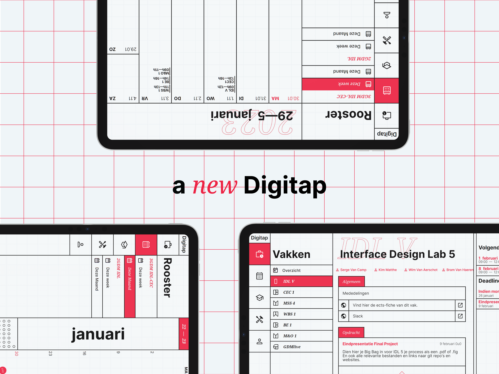
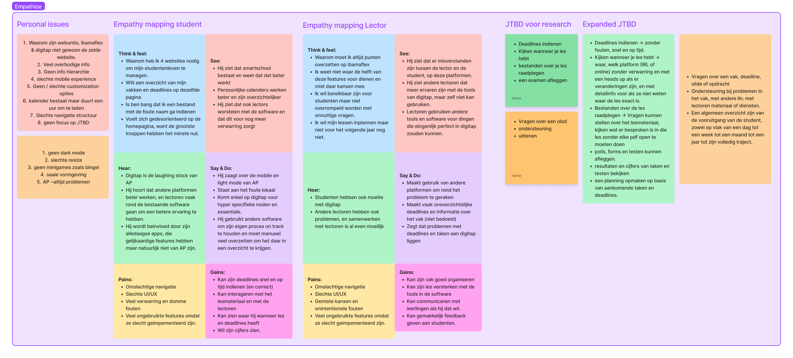
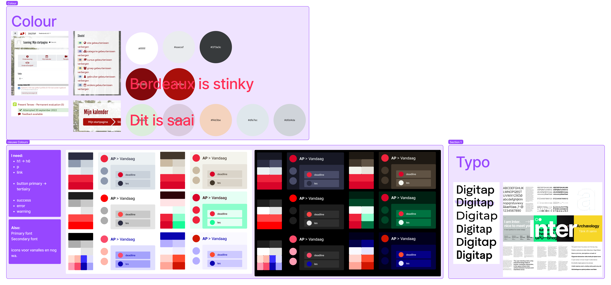
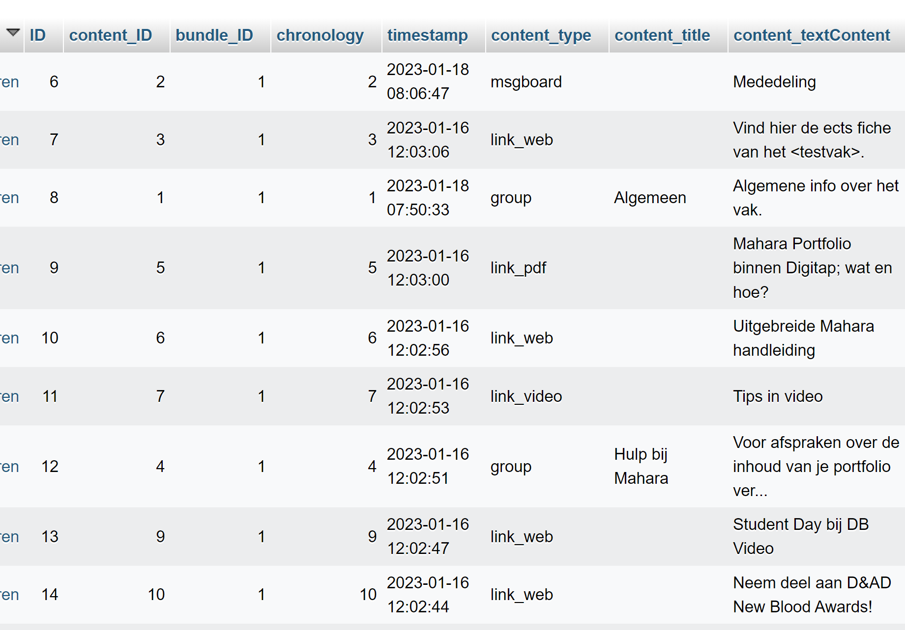
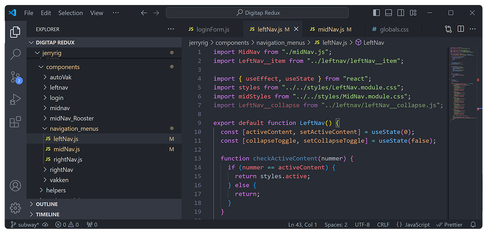
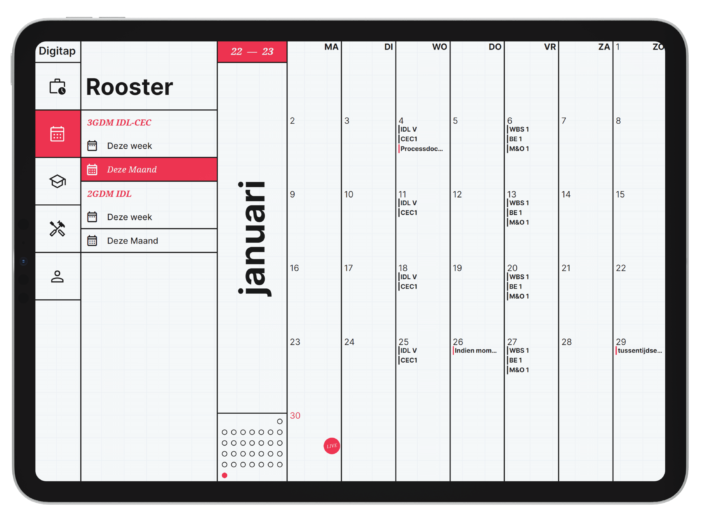
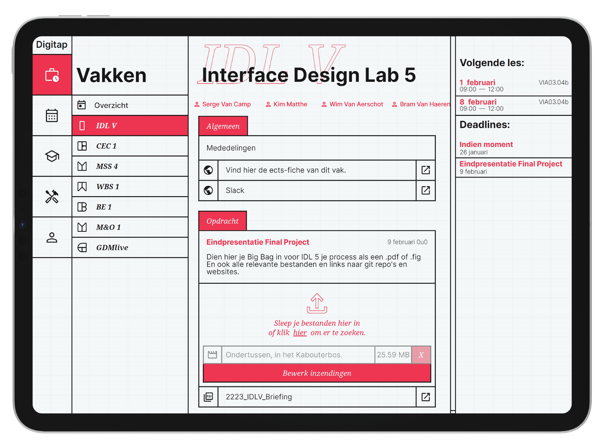
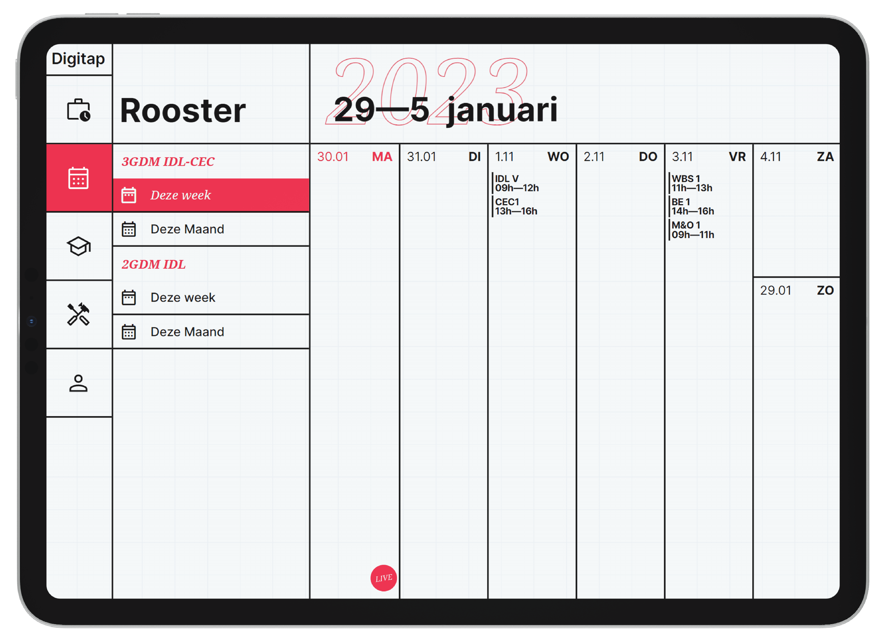

Mijn final project voor Grafische en Digitale Media, mijn poging om het digitaal platform van AP hogeschool een facelift te geven.
 

<!-- Hier filmpje -->

<h3>About</h3>

De opdracht voor Interface Design Lab 5, was om een website te pakken die je gebruikt in het dagelijks leven en die een facelift te geven.
  

Digitap, webuntis en Ibamaflex zijn de heilige drievuldigheid die het studentenleven op AP hogeschool rechthouden,  
Natuurlijk eerder omdat het moet dan omdat het leuk is.   
Van mijn humble beginnings met socket.io en wat php naar Next.js API's en 0auth account testjes. 
Ik wou dat dit project me 'up to speed' bracht met wat de industry standaarden zoal waren.

 
<h4>Understand</h4>
<!-- Hier img invoegen -->

Digitap begrijpen en vooral begrijpen wat er mis is met Digitap is oppervlakkig gezien niet moeilijk. 
Maar wordt moeilijker als je het weldegelijk moet oplossen.  

Empathy mapping, user interviews, en vooral veel stil over andermans schouder meekijken terwijl ik de knikken en bulten in hun process probeer te begrijpen.

 
  

<h4>Explore</h4>
<!-- Hier img invoegen -->

Onderzoek doen naar de vormgeving van mijn overhaul, was op vlak van kleur vrij snel gedaan. 
Maar voor de navigatie was het verder zoeken, met de sitemap dat ik heb gemaakt in de vorige stap
kon ik gaan rondkijken wie ik ging volgen als het ging over navigatie, menu design & information hierarchie.  

Google's Material You heeft een stevige basis om op te bouwen, maar met WWDC dat mooi getimed was tijdens het process, 
heb ik me ineens bijgeschoold op hun livestream.

 
<h4>Materialize - A4 na A4</h4>
<!-- hier schetsjes -->

Met een overvloed aan ideeën & een week tijd om het allemaal klaar te krijgen, heb ik mezelf doodgeschetst. 
Van uitgeblokte UI's met viltstiften, tot in detail vormgeving van een klok (die je al dan niet doet stressen over deadlines).

 

<h4>Materialize - line by line</h4>
<!-- Hier img invoegen -->

Van vanilla naar react is een grote stap, maar van daar naar Next.js draait vooral om het gebruik maken van de features waarvan je nog niet weet dat ze bestaan. 
Met een spoedcursus Next.js op zak, heb ik mezelf aan het werk gezet met de ingebouwde API's, server side rendering trucs. 

 

<h4>Ta daa</h4>
<!-- Hier filmpje -->

Niet zonder blutsen en builen, en met een emergency database reset. 
Maar zonder meer een success in mijn ogen.

 

Het project staat niet online helaas, maar als je zelf eens naar de code wil kijken...
[Dan kan je hier naar de repo ➵](https://github.com/Junta9072/DigitapRedux)
